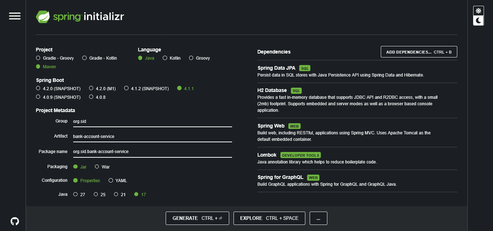

# Rapport de l'Activité Pratique N°1 - Implémentation d'un micro service avec spring boot

`refference :` https://www.youtube.com/watch?v=2-qIoZcvhAw \
`Réalisé par :` HAMZA ELCADI - GLSID3

---

## 1 - Création du projet :
Nous avons utilisé : https://start.spring.io/ \
 \
avec les dépendances :
- *SPRING DATA JPA*
- *H2 DATABASE*
- *SPRING WEB*
- *LOMBOK*
- *SPRING FOR GRAPHQL*

## 2 - Création des entités JPA, enums, et repositories :

