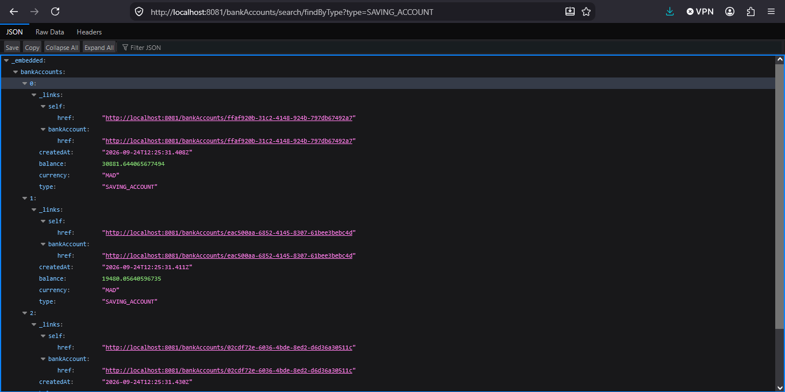
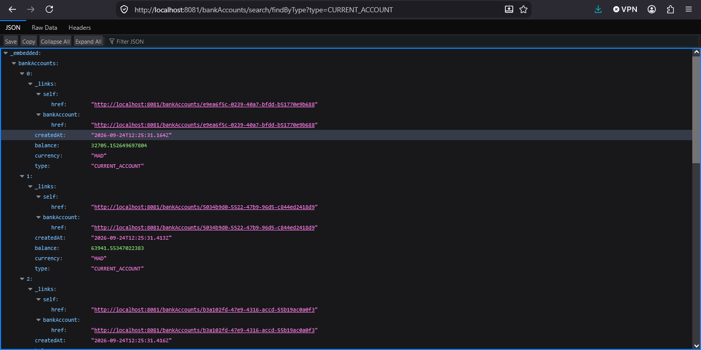
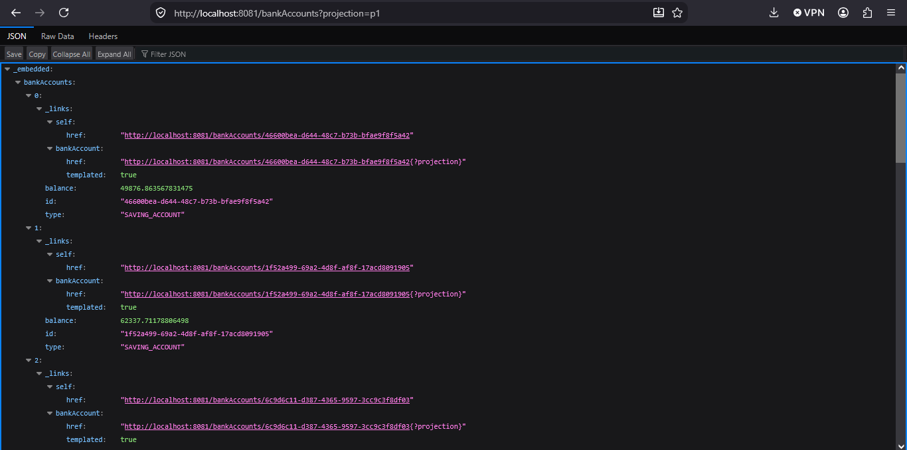
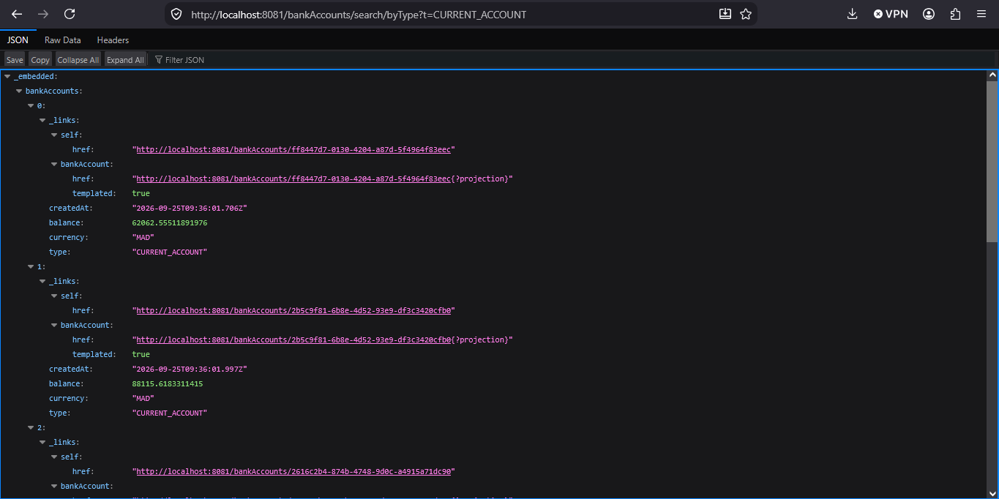
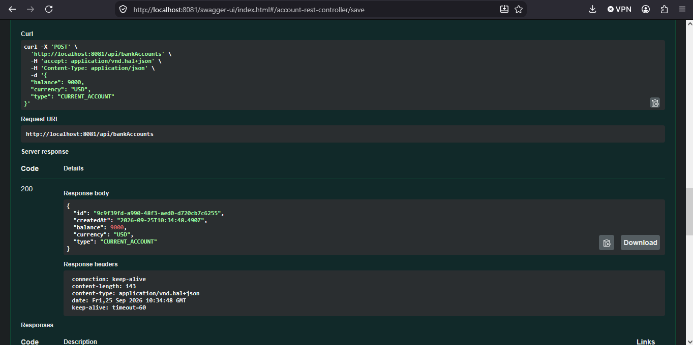

# Rapport de l'Activité Pratique N°1 - Implémentation d'un microservice avec Spring Boot

`Référence :` https://www.youtube.com/watch?v=2-qIoZcvhAw \
`Réalisé par :` HAMZA ELCADI - GLSID3

---

## 1 - Création du projet :

Nous avons utilisé : https://start.spring.io/ \
 \
avec les dépendances :
- *SPRING DATA JPA*
- *H2 DATABASE*
- *SPRING WEB*
- *LOMBOK*
- *SPRING FOR GRAPHQL*

## 2 - Création des entités JPA, des énumérations et des repositories :

Nous avons créé l'entité `BankAccount` (avec la méthode Builder), l'énumération `AccountType` (`SAVING_ACCOUNT`, `CURRENT_ACCOUNT`), ainsi que le repository `BankAccountRepository`. \
Après, nous avons ajouté des comptes bancaires à l'aide de `CommandLineRunner`.

```

@Bean
CommandLineRunner start(BankAccountRepository bankAccountRepository) {
    return args -> {
        for (int i = 0 ; i < 10 ; i++){
            BankAccount bankAccount = BankAccount.builder()
            .id(UUID.randomUUID().toString())
            .type(Math.random()>0.5? AccountType.CURRENT_ACCOUNT: AccountType.SAVING_ACCOUNT)
            .balance(1000+Math.random()*90000)
            .createdAt(new Date())
            .currency("MAD")
            .build();
            bankAccountRepository.save(bankAccount);
        }
    };
}

```

Après, nous avons mis à jour le fichier `application.properties` :

```

spring.datasource.url=jdbc:h2:mem:account-db
spring.h2.console.enabled=true
server.port=8081

````

Après, nous nous sommes connectés à H2 : \
 \
 \

## 3 - Création du service REST permettant de gérer des comptes

Nous avons créé le package `web` avec la classe `AccountRestController` et nous avons défini les mappings ainsi que les méthodes permettant d'obtenir la liste des comptes bancaires et un seul compte bancaire par son identifiant. \
Puis, nous avons créé deux méthodes pour ajouter, modifier et supprimer des comptes.

```java
@RestController
public class AccountRestController {
    private BankAccountRepository bankAccountRepository;

    public AccountRestController(BankAccountRepository bankAccountRepository) {
        this.bankAccountRepository = bankAccountRepository;
    }

    @GetMapping("/bankAccounts")
    public List <BankAccount> bankAccounts() {
        return  bankAccountRepository.findAll();
    }

    @GetMapping("/bankAccounts/{id}")
    public BankAccount bankAccount(@PathVariable String id) {
        return  bankAccountRepository.findById(id)
                .orElseThrow(() -> new RuntimeException(String.format("account %s not found",id)));
    }

    @PostMapping("/bankAccounts")
    public BankAccount save (@RequestBody BankAccount bankAccount) {
        if(bankAccount.getId() == null) bankAccount.setId(UUID.randomUUID().toString());
        if(bankAccount.getCreatedAt() == null) bankAccount.setCreatedAt(new Date());
        return bankAccountRepository.save(bankAccount);
    }
    @PutMapping("/bankAccounts/{id}")
    public BankAccount update (@PathVariable String id, @RequestBody BankAccount bankAccount) {
        BankAccount account = bankAccountRepository.findById(id).orElseThrow();
        if(bankAccount.getBalance() != null) account.setBalance(bankAccount.getBalance());
        if(bankAccount.getCurrency() != null) account.setCurrency(bankAccount.getCurrency());
        if(bankAccount.getType() != null) account.setType(bankAccount.getType());
        if(bankAccount.getCreatedAt() != null) account.setCreatedAt(new Date());
        return bankAccountRepository.save(account);
    }

    @DeleteMapping("/bankAccounts/{id}")
    public void delete (@PathVariable String id) {
        bankAccountRepository.deleteById(id);
    }
}
````

Nous avons effectué les tests :


Et si un compte bancaire n'existe pas :
 \

## 4 - Test du microservice web en utilisant un client REST comme Postman

Nous allons tester avec `Postman`.


 \

## 5. Génération et test de la documentation Swagger des API REST du service web

Tout d'abord, nous ajoutons la dépendance de Swagger.

Nous allons sur le site https://mvnrepository.com/artifact/org.springdoc/springdoc-openapi-ui/1.6.11 et nous copions la dépendance dans le fichier Maven `pom.xml`.

 

Note : cette méthode ne fonctionne plus, nous utilisons donc cette dépendance à la place :

```xml
<dependency>
    <groupId>org.springdoc</groupId>
    <artifactId>springdoc-openapi-starter-webmvc-ui</artifactId>
    <version>3.1.1</version>
</dependency>
```

Nous obtenons la documentation à l'adresse http://localhost:8081/swagger-ui/index.html


 \

Nous pouvons exporter Swagger vers d'autres outils comme Postman en utilisant simplement le lien.


 \

si tu va ajouter un REST API sans pass de la couche metier on utilisant `spring data REST`. \
on ajoute la dependance dans `pom.xml`
```xml
<dependency>
    <groupId>org.springframework.boot</groupId>
    <artifactId>spring-boot-starter-data-rest</artifactId>
</dependency>
```
et changer dans le repository on ajoutons une anotation et la methode de `findBytype`
```java
@RepositoryRestResource
public interface BankAccountRepository extends JpaRepository<BankAccount, String> {
    List<BankAccount> findByType(AccountType type);
}
```
 \
 \

## 6 -  Exposetion une API Restful en utilisant Spring Data Rest en exploitant des projections
on creer une interface `AccountProjection`
```java
@Projection(types = BankAccount.class, name = "p1")
public interface AccountProjection {
    public String getId();
    public AccountType getType();
    public Double getBalance();

}
```
Note mais au premier updater le `AccountRestController.java` pour pas fais des conflits avec lautre Rest
```java
@RequestMapping("/api")
// ajouter ca pour changer the endpoint of the manual rest to /api/bankAccounts instead of just /bankAccounts
```
et si on entrer a http://localhost:8081/bankAccounts?projection=p1 on gonna see
 \
pour le REST on peut changer les nom dans `BankAccountRepository`
```java
@RepositoryRestResource
public interface BankAccountRepository extends JpaRepository<BankAccount, String> {
    @RestResource(path = "/byType" )
    List<BankAccount> findByType(@Param("t") AccountType type);
}
```
les annotation `RestRousource` et `@Param` permet de ca.
c-a-d on place de http://localhost:8081/bankAccounts/search/findByType?type=CURRENT_ACCOUNT on peut utiliser
http://localhost:8081/bankAccounts/search/byType?t=CURRENT_ACCOUNT
 \

## 6 - Création des DTOs et Mappers
on creer un package `service` dans laquelle on creer l'interface `AccountService`
```java
public interface AccountService {
    BankAccountResponseDTO addAccount(BankAccountRequestDTO bankAccountRequestDTO);
}
```
avec `dto/BankAccountResponseDTO` :
```java
@Data @NoArgsConstructor @AllArgsConstructor @Builder
public class BankAccountResponseDTO {
    private String id;
    private Date createdAt;
    private Double balance;
    private String currency;
    private AccountType type;
}
```
et `dto/BankAccountRequestDTO` :
```java
@Data @NoArgsConstructor @AllArgsConstructor @Builder
public class BankAccountRequestDTO {
    private Double balance;
    private String currency;
    private AccountType type;
}
```
et en implimenter linterface `AccountServiceImpl` :
```java
@Service
@Transactional
public class AccountServiceImpl implements AccountService {
    @Autowired
    private BankAccountRepository bankAccountRepository;
    // you can intiat the mapper or make the methode static and work directly with it
    // private BankAccountMapper bankAccountMapper;
    @Override
    public BankAccountResponseDTO addAccount(BankAccountRequestDTO bankAccountRequestDTO) {
        // create the object using the mapper
        BankAccount bankAccount = BankAccountMapper.fromBankAccountRequestDTO(bankAccountRequestDTO);
        // save the object
        BankAccount savedBankAccount = bankAccountRepository.save(bankAccount);
        // copy the object or return it directly
        return BankAccountMapper.toBankAccountResponseDTO(savedBankAccount);
    }
}
```
with the mappper `mapper/BankAccoutMapper`
```java
public class BankAccountMapper {

    public static BankAccount fromBankAccountRequestDTO (BankAccountRequestDTO bankAccountRequestDTO) {
        return BankAccount.builder()
                .id(UUID.randomUUID().toString())
                .createdAt(new Date())
                .balance(bankAccountRequestDTO.getBalance())
                .type(bankAccountRequestDTO.getType())
                .currency(bankAccountRequestDTO.getCurrency())
                .build();
    }
    public static BankAccountResponseDTO toBankAccountResponseDTO (BankAccount bankAccount) {
        return BankAccountResponseDTO.builder()
                .id(bankAccount.getId())
                .createdAt(bankAccount.getCreatedAt())
                .balance(bankAccount.getBalance())
                .type(bankAccount.getType())
                .currency(bankAccount.getCurrency())
                .build();
    }
}
```
apres l'implimentation on utilse dans le controller `web/AccountRestController`
et changer la methode save
```java
private BankAccountRepository bankAccountRepository;
private AccountService accountService;

public AccountRestController(BankAccountRepository bankAccountRepository, AccountService accountService) {
    this.bankAccountRepository = bankAccountRepository;
    this.accountService = accountService;
}

@PostMapping("/bankAccounts")
public BankAccountResponseDTO save (@RequestBody BankAccountRequestDTO requestDTO) {
    return accountService.addAccount(requestDTO);
}

```

 \

## 7 - Création d'un Web service GraphQL pour ce Micro-service
