# Rapport de l'Activité Pratique N°1 - Implémentation d'un microservice avec Spring Boot

**Référence :** https://www.youtube.com/watch?v=2-qIoZcvhAw
**Réalisé par :** HAMZA ELCADI - GLSID3

---

## 1 - Création du projet

Nous avons utilisé le site [Spring Initializr](https://start.spring.io/) pour générer le projet :

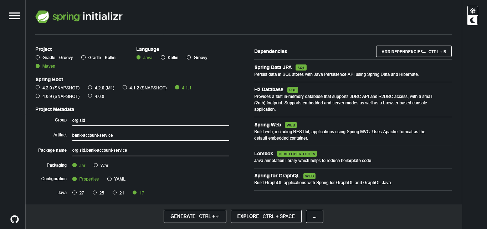

avec les dépendances suivantes :
- **Spring Data JPA**
- **H2 Database**
- **Spring Web**
- **Lombok**
- **Spring for GraphQL**

## 2 - Création des entités JPA, des énumérations et des repositories

Nous avons créé l'entité `BankAccount` (en utilisant le patron *Builder* de Lombok), l'énumération `AccountType` (`SAVING_ACCOUNT`, `CURRENT_ACCOUNT`), ainsi que le repository `BankAccountRepository`.

Ensuite, nous avons ajouté des comptes bancaires à l'aide d'un `CommandLineRunner` afin de peupler la base de données au démarrage de l'application :

```java
@Bean
CommandLineRunner start(BankAccountRepository bankAccountRepository) {
    return args -&gt; {
        for (int i = 0; i &lt; 10; i++) {
            BankAccount bankAccount = BankAccount.builder()
                    .id(UUID.randomUUID().toString())
                    .type(Math.random() &gt; 0.5 ? AccountType.CURRENT_ACCOUNT : AccountType.SAVING_ACCOUNT)
                    .balance(1000 + Math.random() * 90000)
                    .createdAt(new Date())
                    .currency("MAD")
                    .build();
            bankAccountRepository.save(bankAccount);
        }
    };
}
```

Par la suite, nous avons mis à jour le fichier `application.properties` :

```properties
spring.datasource.url=jdbc:h2:mem:account-db
spring.h2.console.enabled=true
server.port=8081
```

Nous nous sommes ensuite connectés à la console H2 :


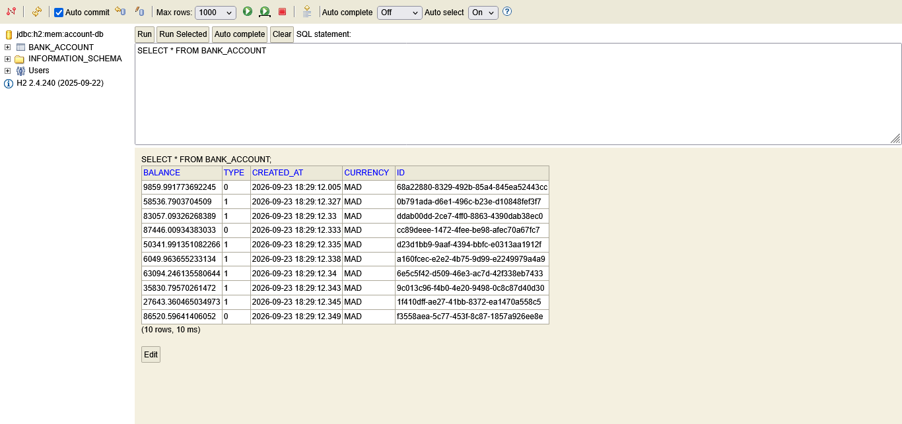

## 3 - Création du service REST de gestion des comptes

Nous avons créé le package `web` contenant la classe `AccountRestController`, dans laquelle nous avons défini les mappings ainsi que les méthodes permettant d'obtenir la liste des comptes bancaires et un compte bancaire par son identifiant.

Nous avons ensuite créé les méthodes permettant d'ajouter, de modifier et de supprimer des comptes :

```java
@RestController
public class AccountRestController {
    private BankAccountRepository bankAccountRepository;

    public AccountRestController(BankAccountRepository bankAccountRepository) {
        this.bankAccountRepository = bankAccountRepository;
    }

    @GetMapping("/bankAccounts")
    public List&lt;BankAccount&gt; bankAccounts() {
        return bankAccountRepository.findAll();
    }

    @GetMapping("/bankAccounts/{id}")
    public BankAccount bankAccount(@PathVariable String id) {
        return bankAccountRepository.findById(id)
                .orElseThrow(() -&gt; new RuntimeException(String.format("account %s not found", id)));
    }

    @PostMapping("/bankAccounts")
    public BankAccount save(@RequestBody BankAccount bankAccount) {
        if (bankAccount.getId() == null) bankAccount.setId(UUID.randomUUID().toString());
        if (bankAccount.getCreatedAt() == null) bankAccount.setCreatedAt(new Date());
        return bankAccountRepository.save(bankAccount);
    }

    @PutMapping("/bankAccounts/{id}")
    public BankAccount update(@PathVariable String id, @RequestBody BankAccount bankAccount) {
        BankAccount account = bankAccountRepository.findById(id).orElseThrow();
        if (bankAccount.getBalance() != null) account.setBalance(bankAccount.getBalance());
        if (bankAccount.getCurrency() != null) account.setCurrency(bankAccount.getCurrency());
        if (bankAccount.getType() != null) account.setType(bankAccount.getType());
        if (bankAccount.getCreatedAt() != null) account.setCreatedAt(new Date());
        return bankAccountRepository.save(account);
    }

    @DeleteMapping("/bankAccounts/{id}")
    public void delete(@PathVariable String id) {
        bankAccountRepository.deleteById(id);
    }
}
```

Nous avons effectué les tests suivants :

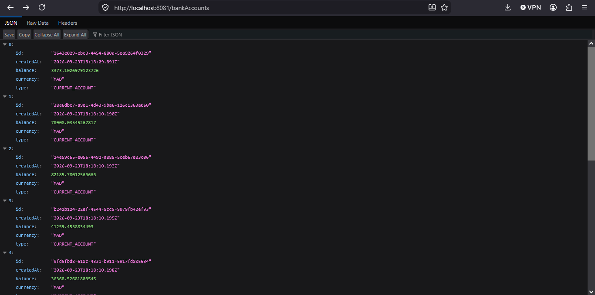
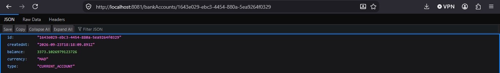

Et dans le cas où le compte bancaire n'existe pas :

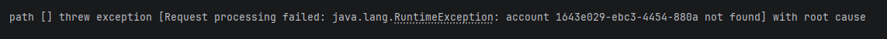

## 4 - Test du microservice à l'aide d'un client REST (Postman)

Nous allons tester notre API à l'aide de l'outil **Postman** :

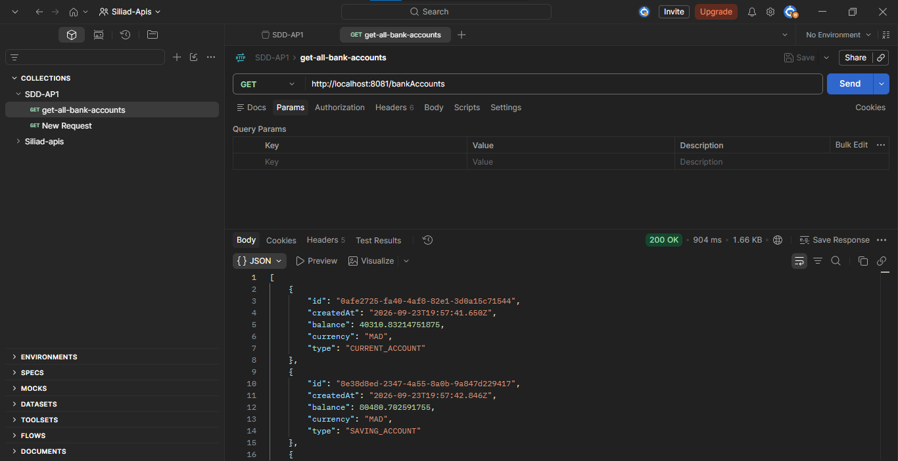
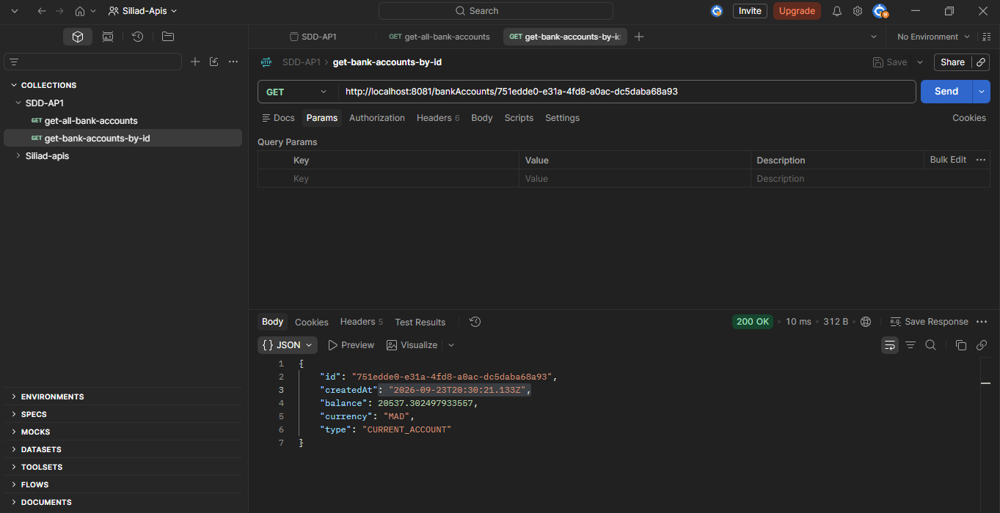
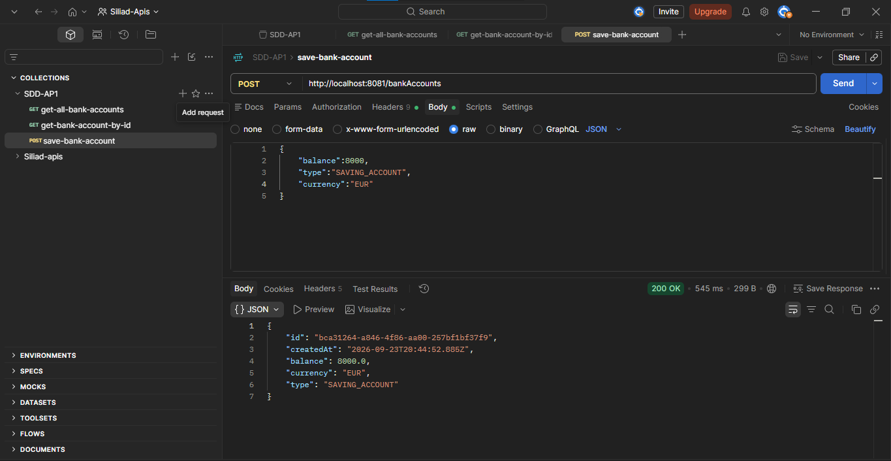
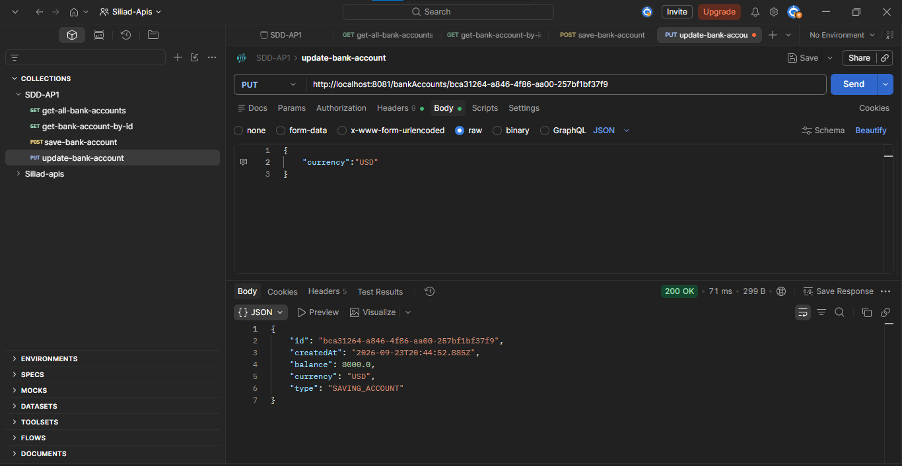
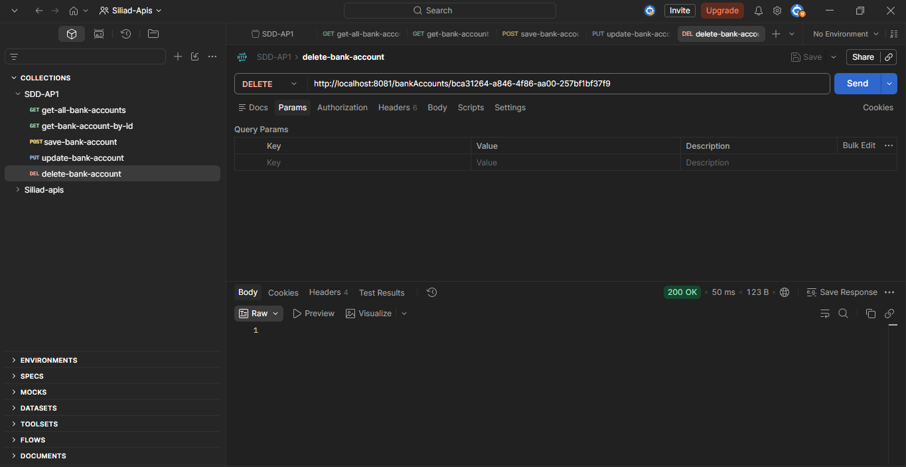

## 5 - Génération et test de la documentation Swagger des API REST

Tout d'abord, nous ajoutons la dépendance Swagger.

Nous nous rendons sur le site https://mvnrepository.com/artifact/org.springdoc/springdoc-openapi-ui/1.6.11 et nous copions la dépendance dans le fichier Maven `pom.xml` :

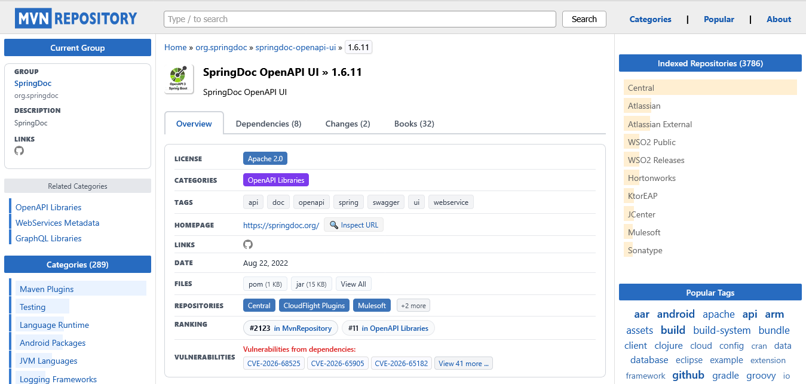

&gt; **Remarque :** cette méthode ne fonctionne plus avec les versions récentes de Spring Boot. Nous utilisons donc la dépendance suivante à la place :

```xml
&lt;dependency&gt;
    &lt;groupId&gt;org.springdoc&lt;/groupId&gt;
    &lt;artifactId&gt;springdoc-openapi-starter-webmvc-ui&lt;/artifactId&gt;
    &lt;version&gt;3.1.1&lt;/version&gt;
&lt;/dependency&gt;
```

La documentation est ensuite accessible à l'adresse http://localhost:8081/swagger-ui/index.html :

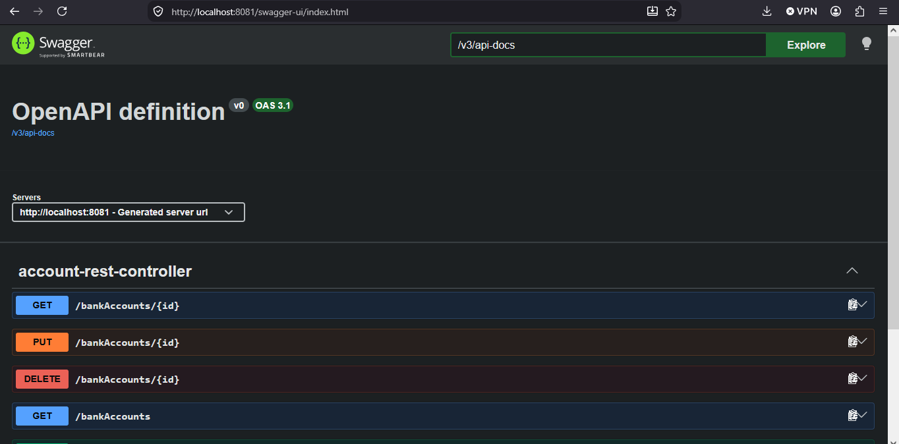
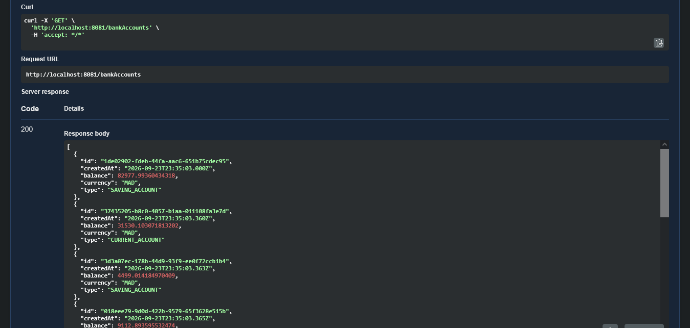

Nous pouvons également exporter la documentation Swagger vers d'autres outils comme Postman en utilisant simplement le lien de la spécification OpenAPI :

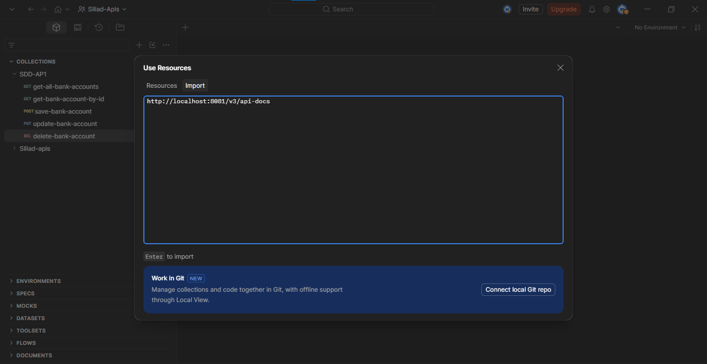
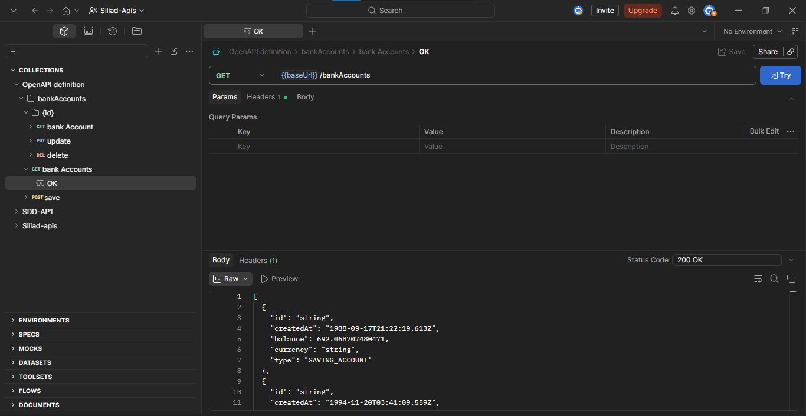

### Exposition d'une API REST sans couche métier grâce à Spring Data REST

Si l'on souhaite exposer une API REST **sans passer par la couche métier**, on peut utiliser **Spring Data REST**.

Pour cela, nous ajoutons la dépendance suivante dans le fichier `pom.xml` :

```xml
&lt;dependency&gt;
    &lt;groupId&gt;org.springframework.boot&lt;/groupId&gt;
    &lt;artifactId&gt;spring-boot-starter-data-rest&lt;/artifactId&gt;
&lt;/dependency&gt;
```

Ensuite, nous modifions le repository en y ajoutant une annotation et la méthode `findByType` :

```java
@RepositoryRestResource
public interface BankAccountRepository extends JpaRepository&lt;BankAccount, String&gt; {
    List&lt;BankAccount&gt; findByType(AccountType type);
}
```

Les endpoints générés automatiquement sont alors accessibles :

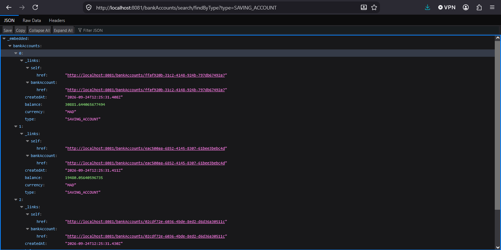
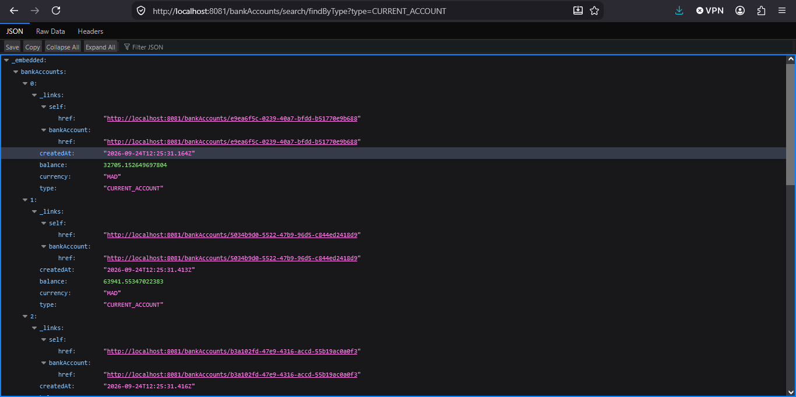

## 6 - Exposition d'une API RESTful avec Spring Data REST et les projections

Nous créons une interface `AccountProjection` :

```java
@Projection(types = BankAccount.class, name = "p1")
public interface AccountProjection {
    String getId();
    AccountType getType();
    Double getBalance();
}
```

&gt; **Remarque :** il faut d'abord modifier `AccountRestController.java` afin d'éviter les conflits entre le contrôleur REST manuel et les endpoints générés automatiquement par Spring Data REST :

```java
@RequestMapping("/api")
// Cette annotation permet de changer le point d'accès du REST manuel vers /api/bankAccounts
// au lieu de /bankAccounts
```

En accédant ensuite à http://localhost:8081/bankAccounts?projection=p1, nous obtenons :

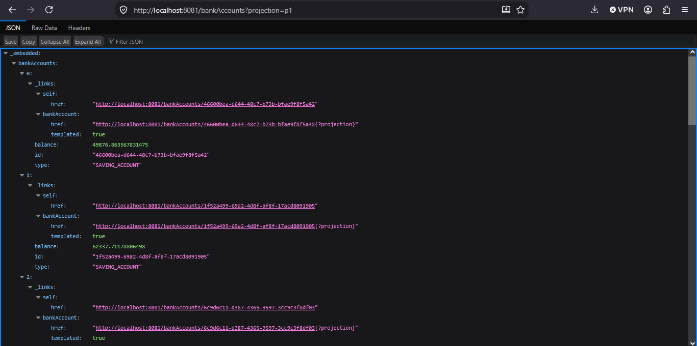

Pour le REST, nous pouvons personnaliser les noms des endpoints directement dans `BankAccountRepository` :

```java
@RepositoryRestResource
public interface BankAccountRepository extends JpaRepository&lt;BankAccount, String&gt; {
    @RestResource(path = "/byType")
    List&lt;BankAccount&gt; findByType(@Param("t") AccountType type);
}
```

Les annotations `@RestResource` et `@Param` permettent cette personnalisation.

C'est-à-dire qu'au lieu de :
`http://localhost:8081/bankAccounts/search/findByType?type=CURRENT_ACCOUNT`

nous pouvons désormais utiliser :
`http://localhost:8081/bankAccounts/search/byType?t=CURRENT_ACCOUNT`

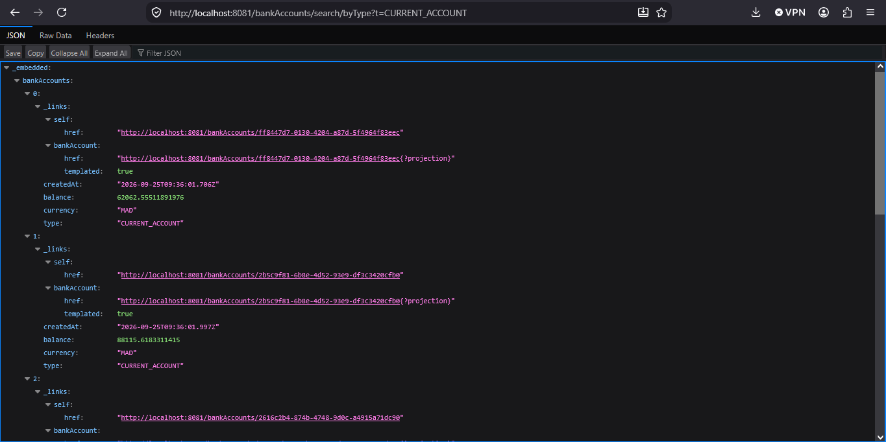

## 7 - Création des DTOs et des Mappers

Nous créons un package `service` dans lequel nous définissons l'interface `AccountService` :

```java
public interface AccountService {
    BankAccountResponseDTO addAccount(BankAccountRequestDTO bankAccountRequestDTO);
}
```

avec le DTO `dto/BankAccountResponseDTO` :

```java
@Data @NoArgsConstructor @AllArgsConstructor @Builder
public class BankAccountResponseDTO {
    private String id;
    private Date createdAt;
    private Double balance;
    private String currency;
    private AccountType type;
}
```

et le DTO `dto/BankAccountRequestDTO` :

```java
@Data @NoArgsConstructor @AllArgsConstructor @Builder
public class BankAccountRequestDTO {
    private Double balance;
    private String currency;
    private AccountType type;
}
```

Nous implémentons ensuite cette interface dans la classe `AccountServiceImpl` :

```java
@Service
@Transactional
public class AccountServiceImpl implements AccountService {
    @Autowired
    private BankAccountRepository bankAccountRepository;

    @Override
    public BankAccountResponseDTO addAccount(BankAccountRequestDTO bankAccountRequestDTO) {
        // Création de l'objet à l'aide du mapper
        BankAccount bankAccount = BankAccountMapper.fromBankAccountRequestDTO(bankAccountRequestDTO);
        // Sauvegarde de l'objet
        BankAccount savedBankAccount = bankAccountRepository.save(bankAccount);
        // Conversion et retour du DTO de réponse
        return BankAccountMapper.toBankAccountResponseDTO(savedBankAccount);
    }
}
```

avec le mapper `mapper/BankAccountMapper` :

```java
public class BankAccountMapper {

    public static BankAccount fromBankAccountRequestDTO(BankAccountRequestDTO bankAccountRequestDTO) {
        return BankAccount.builder()
                .id(UUID.randomUUID().toString())
                .createdAt(new Date())
                .balance(bankAccountRequestDTO.getBalance())
                .type(bankAccountRequestDTO.getType())
                .currency(bankAccountRequestDTO.getCurrency())
                .build();
    }

    public static BankAccountResponseDTO toBankAccountResponseDTO(BankAccount bankAccount) {
        return BankAccountResponseDTO.builder()
                .id(bankAccount.getId())
                .createdAt(bankAccount.getCreatedAt())
                .balance(bankAccount.getBalance())
                .type(bankAccount.getType())
                .currency(bankAccount.getCurrency())
                .build();
    }
}
```

Après cette implémentation, nous l'utilisons dans le contrôleur `web/AccountRestController` en modifiant la méthode `save` :

```java
private BankAccountRepository bankAccountRepository;
private AccountService accountService;

public AccountRestController(BankAccountRepository bankAccountRepository, AccountService accountService) {
    this.bankAccountRepository = bankAccountRepository;
    this.accountService = accountService;
}

@PostMapping("/bankAccounts")
public BankAccountResponseDTO save(@RequestBody BankAccountRequestDTO requestDTO) {
    return accountService.addAccount(requestDTO);
}
```

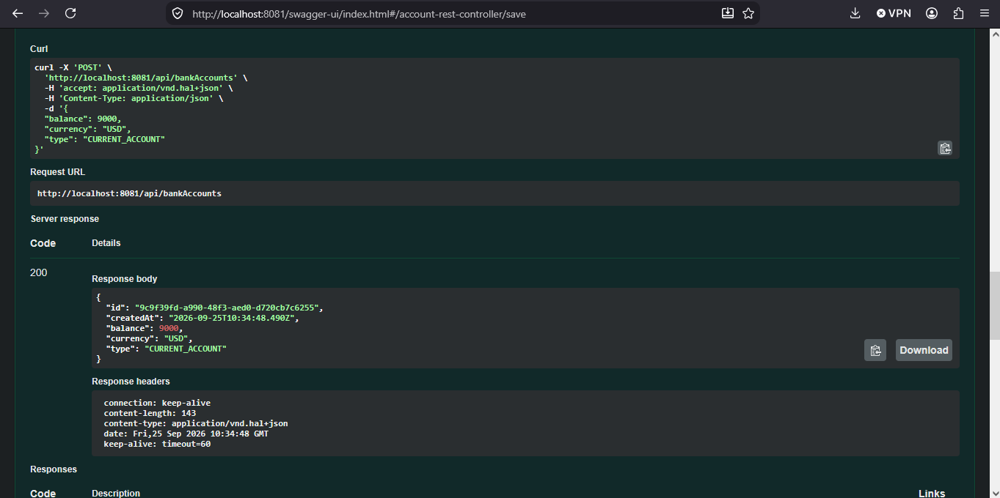

## 8 - Création d'un service web GraphQL pour ce microservice

Tout d'abord, nous créons le dossier `graphql` dans le dossier `resources`, puis un fichier `schema.graphqls` :

```graphql
type Query {
    accountList: [BankAccount]
}

type BankAccount {
    id: String,
    createdAt: String,
    balance: Float,
    currency: String,
    type: String
}
```

Nous créons ensuite, dans le package `web`, la classe `BankAccountGraphQLController` :

```java
@Controller
public class BankAccountGraphQLController {
    @Autowired
    private BankAccountRepository bankAccountRepository;

    @QueryMapping
    public List&lt;BankAccount&gt; accountList() {
        return bankAccountRepository.findAll();
    }
}
```

&gt; **Remarque :** si le nom de la méthode du contrôleur ne correspond pas au nom défini dans le schéma GraphQL (dans ce cas `accountList`), il faut préciser explicitement le nom : `@QueryMapping("nomDansLeSchema")`.

Nous activons ensuite l'interface GraphiQL dans le fichier `application.properties` :

```properties
spring.graphql.graphiql.enabled=true
```

L'interface est accessible à l'adresse http://localhost:8081/graphiql?path=/graphql :

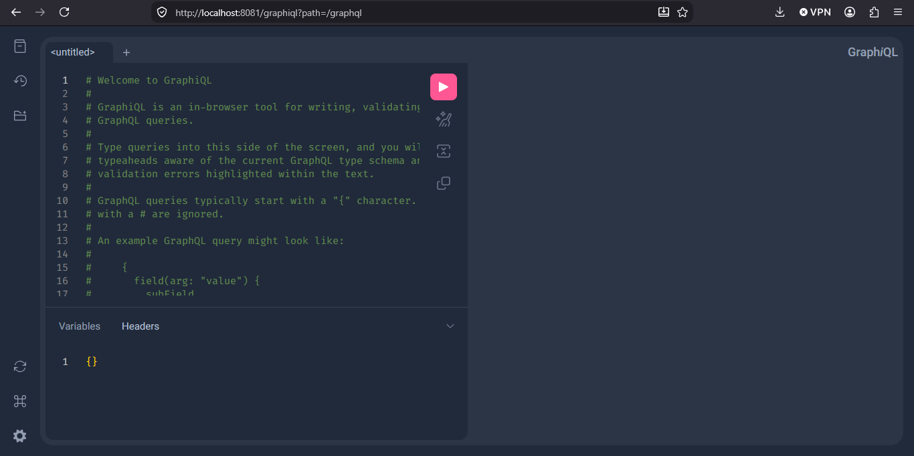

Dans cette interface, nous pouvons exécuter des requêtes de type `query` ou `mutation`. Dans ces requêtes, nous pouvons spécifier uniquement les attributs dont nous avons besoin :

```graphql
query {
    accountList {
        id
        balance
        createdAt
    }
}
```

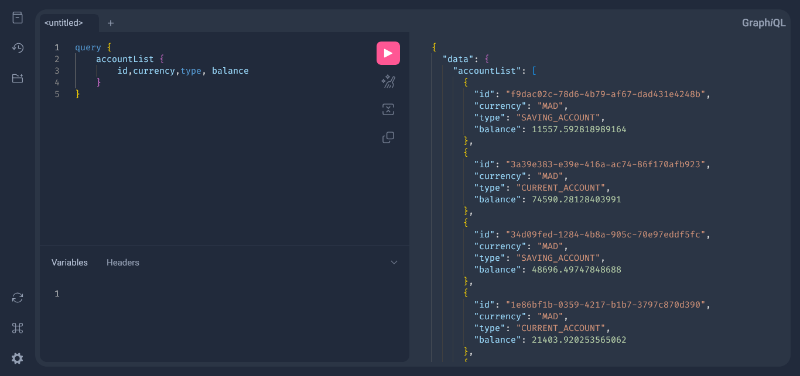

Nous ajoutons une autre méthode dans `BankAccountGraphQLController` :

```java
@QueryMapping(name = "accountById")
public BankAccount bankAccountById(@Argument String id) {
    return bankAccountRepository.findById(id)
            .orElseThrow(() -&gt; new RuntimeException(String.format("Account %s not found", id)));
}
```

et nous mettons à jour le fichier GraphQL :

```graphql
type Query {
    accountList: [BankAccount]
    accountById(id: String): BankAccount
}
```

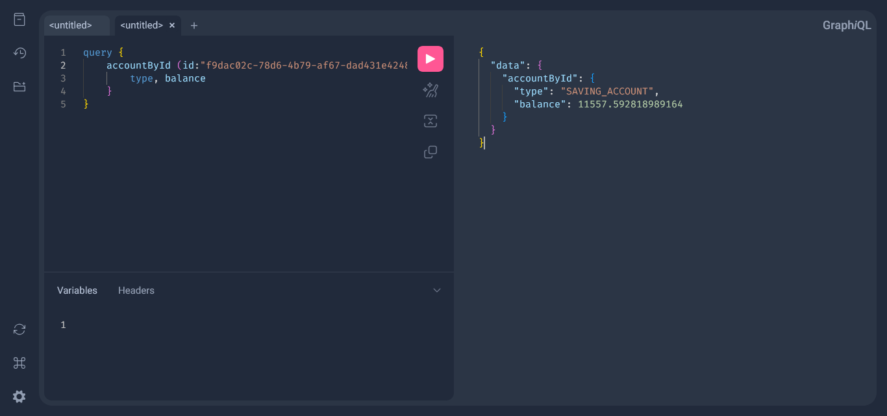

Nous ajoutons ensuite un gestionnaire d'erreurs personnalisé :

```java
@Component
public class CustomDataFetcherExceptionResolver extends DataFetcherExceptionResolverAdapter {
    @Override
    protected GraphQLError resolveToSingleError(Throwable ex, DataFetchingEnvironment env) {
        return new GraphQLError() {
            @Override
            public String getMessage() {
                return ex.getMessage();
            }

            @Override
            public List&lt;SourceLocation&gt; getLocations() {
                return null;
            }

            @Override
            public ErrorClassification getErrorType() {
                return null;
            }
        };
    }
}
```

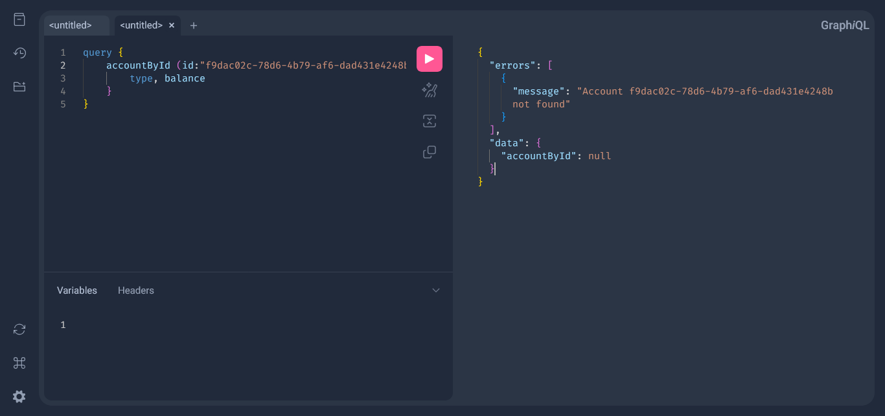

Nous ajoutons la méthode `addAccount` dans `BankAccountGraphQLController` :

```java
@MutationMapping
public BankAccountResponseDTO addAccount(@Argument BankAccountRequestDTO bankAccount) {
    return accountService.addAccount(bankAccount);
}
```

et nous mettons à jour le fichier `schema.graphqls` :

```graphql
type Mutation {
    addAccount(bankAccount: BankAccountDTO): BankAccount
}

input BankAccountDTO {
    balance: Float,
    currency: String,
    type: String
}
```

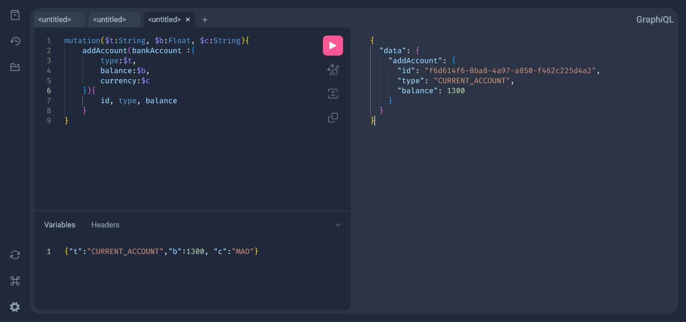

Nous modifions et optimisons le code en utilisant la couche service et les DTOs. Le mapper `BankAccountMapper` devient :

```java
public class BankAccountMapper {

    public static BankAccount fromBankAccountRequestDTO(BankAccountRequestDTO bankAccountRequestDTO) {
        return BankAccount.builder()
                .id(UUID.randomUUID().toString())
                .createdAt(new Date())
                .balance(bankAccountRequestDTO.getBalance())
                .type(bankAccountRequestDTO.getType())
                .currency(bankAccountRequestDTO.getCurrency())
                .build();
    }

    public static BankAccountResponseDTO toBankAccountResponseDTO(BankAccount bankAccount) {
        return BankAccountResponseDTO.builder()
                .id(bankAccount.getId())
                .createdAt(bankAccount.getCreatedAt())
                .balance(bankAccount.getBalance())
                .type(bankAccount.getType())
                .currency(bankAccount.getCurrency())
                .build();
    }

    public static List&lt;BankAccountResponseDTO&gt; toBankAccountResponseDTOList(List&lt;BankAccount&gt; bankAccounts) {
        return bankAccounts.stream()
                .map(BankAccountMapper::toBankAccountResponseDTO)
                .toList();
    }
}
```

et la classe `AccountServiceImpl` :

```java
@Service
@Transactional
public class AccountServiceImpl implements AccountService {
    @Autowired
    private BankAccountRepository bankAccountRepository;

    @Override
    public List&lt;BankAccountResponseDTO&gt; accountList() {
        return BankAccountMapper.toBankAccountResponseDTOList(bankAccountRepository.findAll());
    }

    @Override
    public BankAccountResponseDTO accountById(String id) {
        return BankAccountMapper.toBankAccountResponseDTO(bankAccountRepository
                .findById(id)
                .orElseThrow(() -&gt; new RuntimeException(String.format("Account %s not found", id))));
    }

    @Override
    public BankAccountResponseDTO addAccount(BankAccountRequestDTO bankAccountRequestDTO) {
        // Création de l'objet à l'aide du mapper
        BankAccount bankAccount = BankAccountMapper.fromBankAccountRequestDTO(bankAccountRequestDTO);
        // Sauvegarde de l'objet
        BankAccount savedBankAccount = bankAccountRepository.save(bankAccount);
        // Conversion et retour du DTO de réponse
        return BankAccountMapper.toBankAccountResponseDTO(savedBankAccount);
    }

    @Override
    public BankAccountResponseDTO updateAccount(String id, BankAccountRequestDTO bankAccountRequestDTO) {
        bankAccountRepository.findById(id)
                .orElseThrow(() -&gt; new RuntimeException(String.format("Account %s not found", id)));
        BankAccount bankAccount = BankAccount.builder()
                .id(id)
                .balance(bankAccountRequestDTO.getBalance())
                .currency(bankAccountRequestDTO.getCurrency())
                .type(bankAccountRequestDTO.getType())
                .build();
        BankAccount savedBankAccount = bankAccountRepository.save(bankAccount);
        return BankAccountMapper.toBankAccountResponseDTO(savedBankAccount);
    }

    @Override
    public Boolean deleteAccount(String id) {
        bankAccountRepository.findById(id)
                .orElseThrow(() -&gt; new RuntimeException(String.format("Account %s not found", id)));
        bankAccountRepository.deleteById(id);
        return true;
    }
}
```

&gt; **Remarque :** il faut également ajouter ces méthodes dans l'interface `AccountService`.

Le contrôleur `BankAccountGraphQLController` devient :

```java
@Controller
public class BankAccountGraphQLController {
    @Autowired
    private BankAccountRepository bankAccountRepository;
    @Autowired
    private AccountService accountService;

    @QueryMapping
    public List&lt;BankAccountResponseDTO&gt; accountList() {
        return accountService.accountList();
    }

    @QueryMapping(name = "accountById")
    public BankAccountResponseDTO bankAccountById(@Argument String id) {
        return accountService.accountById(id);
    }

    @MutationMapping
    public BankAccountResponseDTO addAccount(@Argument BankAccountRequestDTO bankAccount) {
        return accountService.addAccount(bankAccount);
    }

    @MutationMapping
    public BankAccountResponseDTO updateAccount(@Argument String id, @Argument BankAccountRequestDTO bankAccount) {
        return accountService.updateAccount(id, bankAccount);
    }

    @MutationMapping
    public Boolean deleteAccount(@Argument String id) {
        return accountService.deleteAccount(id);
    }
}
```

et le fichier `schema.graphqls` mis à jour :

```graphql
type Query {
    accountList: [BankAccount]
    accountById(id: String): BankAccount
}

type Mutation {
    addAccount(bankAccount: BankAccountDTO): BankAccount,
    updateAccount(id: String, bankAccount: BankAccountDTO): BankAccount,
    deleteAccount(id: String): Boolean
}

type BankAccount {
    id: String,
    createdAt: String,
    balance: Float,
    currency: String,
    type: String
}

input BankAccountDTO {
    balance: Float,
    currency: String,
    type: String
}
```

Nous testons les requêtes suivantes :

**updateAccount :**

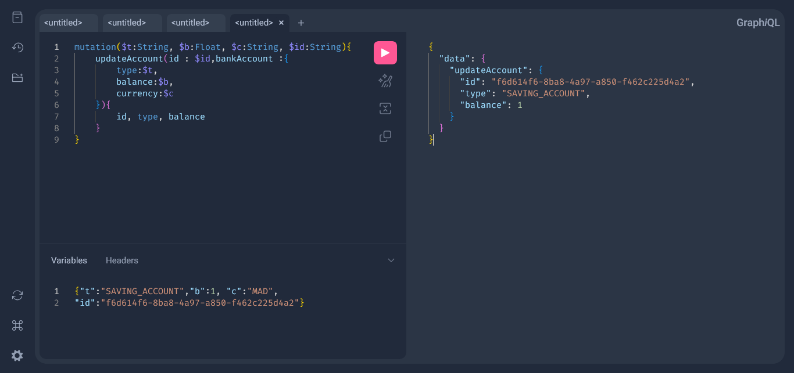

**deleteAccount :**

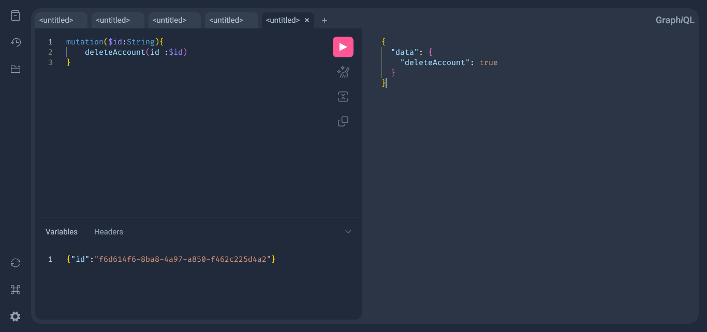

## 9 - Ajout de l'entité Customer et gestion des relations

Nous ajoutons maintenant une classe `Customer` avec une relation `@OneToMany` vers `BankAccount`.

**`Customer` :**

```java
@Entity
@Data
@NoArgsConstructor @AllArgsConstructor @Builder
public class Customer {
    @Id
    @GeneratedValue(strategy = GenerationType.IDENTITY)
    private Long id;
    private String name;

    @OneToMany(mappedBy = "customer")
    private List&lt;BankAccount&gt; bankAccounts;
}
```

**`CustomerRepository` :**

```java
public interface CustomerRepository extends JpaRepository&lt;Customer, Long&gt; {
}
```

Nous créons ensuite des clients dans la classe `BankAccountServiceApplication` :

```java
@Bean
CommandLineRunner start(BankAccountRepository bankAccountRepository, CustomerRepository customerRepository) {
    return args -&gt; {
        Stream.of("name1", "name2", "name3", "name4").forEach(c -&gt; {
            Customer customer = Customer.builder()
                    .name(c)
                    .build();
            customerRepository.save(customer);
        });

        customerRepository.findAll().forEach(customer -&gt; {
            for (int i = 0; i &lt; 10; i++) {
                // Il existe 3 façons d'initialiser un BankAccount :
                // 1. En utilisant le constructeur sans arguments
                // BankAccount bankAccount = new BankAccount();
                // 2. En utilisant le constructeur avec arguments
                // BankAccount bankAccount = new BankAccount(...);
                // 3. En utilisant le builder (@Builder)
                BankAccount bankAccount = BankAccount.builder()
                        .id(UUID.randomUUID().toString())
                        .type(Math.random() &gt; 0.5 ? AccountType.CURRENT_ACCOUNT : AccountType.SAVING_ACCOUNT)
                        .balance(1000 + Math.random() * 90000)
                        .createdAt(new Date())
                        .currency("MAD")
                        .customer(customer)
                        .build();
                bankAccountRepository.save(bankAccount);
            }
        });
    };
}
```

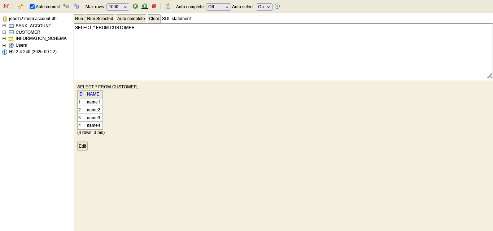
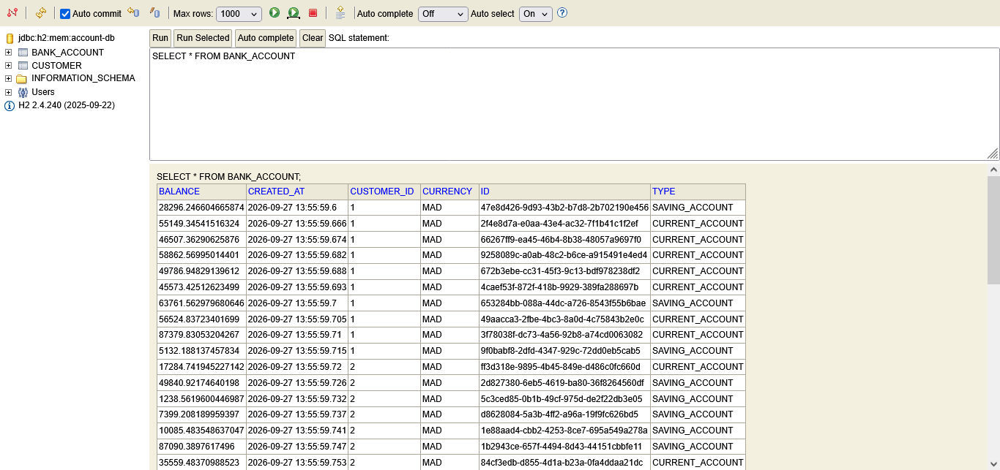

Nous mettons à jour le schéma GraphQL :

```graphql
type Query {
    accountList: [BankAccount]
    accountById(id: String): BankAccount
}

type Mutation {
    addAccount(bankAccount: BankAccountDTO): BankAccount,
    updateAccount(id: String, bankAccount: BankAccountDTO): BankAccount,
    deleteAccount(id: String): Boolean
}

type BankAccount {
    id: String,
    createdAt: String,
    balance: Float,
    currency: String,
    type: String,
    customer: Customer
}

type Customer {
    id: Float,
    name: String
}

input BankAccountDTO {
    balance: Float,
    currency: String,
    type: String
}
```

Nous testons la requête `accountList` sur GraphQL :

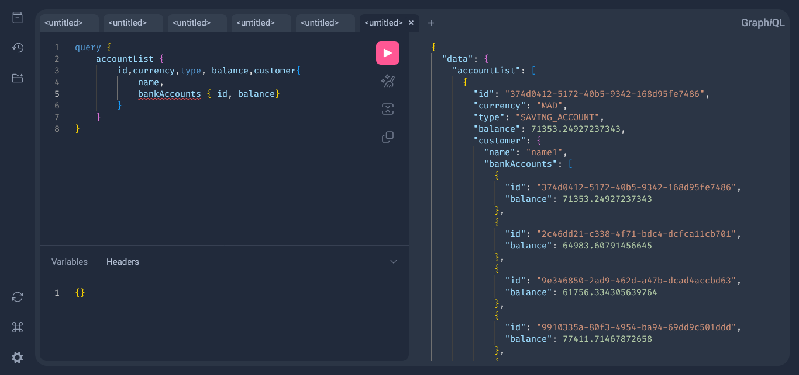

&gt; **Remarque :** contrairement à REST, nous n'avons pas de problème de récursivité avec GraphQL :

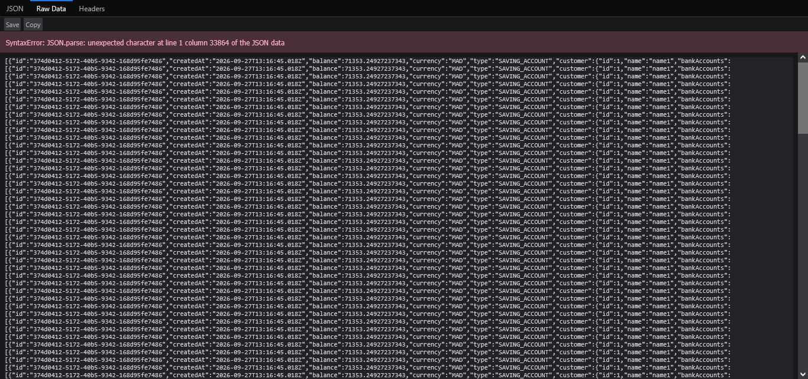

Pour résoudre ce problème côté REST, il faut ajouter dans `Customer.java` :

```java
@JsonProperty(access = JsonProperty.Access.WRITE_ONLY)
private List&lt;BankAccount&gt; bankAccounts;
```

et faire de même dans `BankAccount.java` :

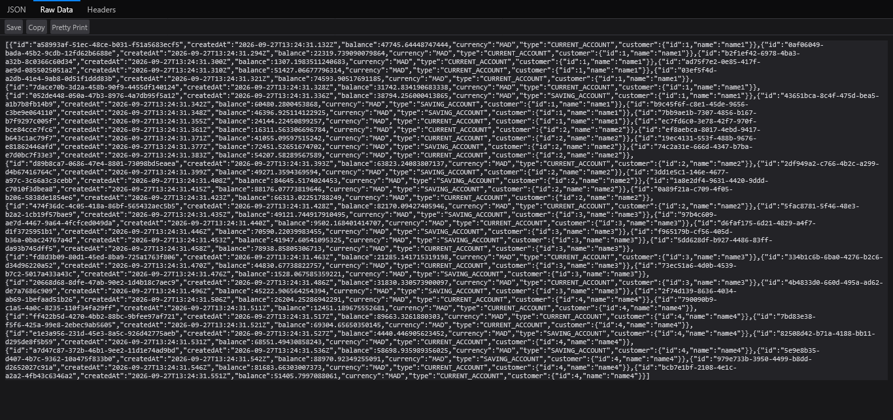

Nous ajoutons ensuite une requête pour lister les clients.

Dans le contrôleur GraphQL :

```java
@Autowired
CustomerRepository customerRepository;

@QueryMapping
public List&lt;Customer&gt; customerList() {
    return customerRepository.findAll();
}
```

et dans le fichier GraphQL :

```graphql
type Query {
    accountList: [BankAccount],
    accountById(id: String): BankAccount,
    customerList: [Customer]
}
```

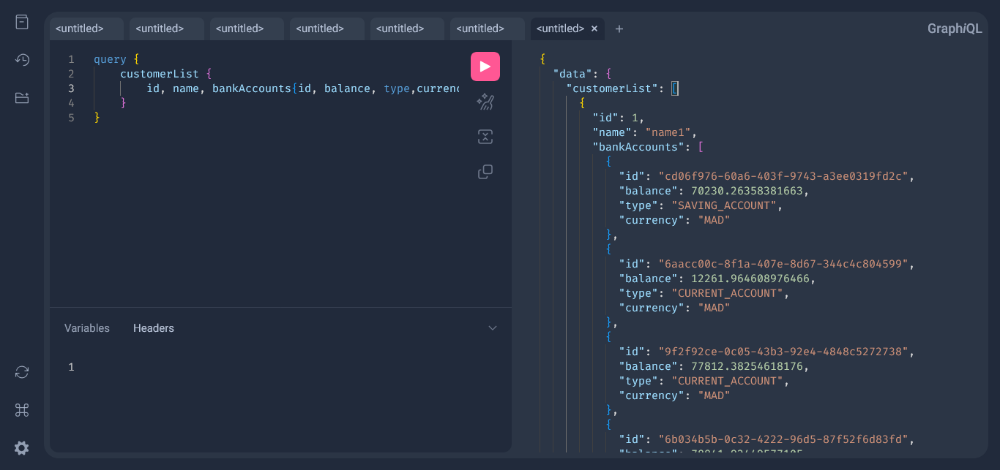   